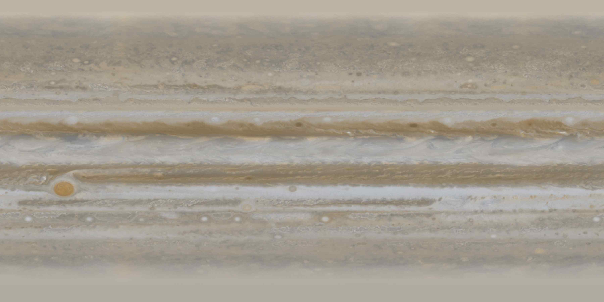

# Jupiter Texture Maps
This is a collection of true color texture maps for the planet Jupiter I have found across the internet, lazily put together.

## Hubble OPAL Cycle 32 v2

* Creator: BurningHot687
* License: CC BY-SA 4.0
* Source: [Full Release](https://github.com/BurningHot687/open-astronomy-catalog/releases/tag/2026.08)
* Note: this uses direct `.fits` data, however it only uses the filters 'f631n' and 'f467m'. It uses a synthetic green using the formula $0.6R + 0.4B$ as an initial approximation. This map was intended to be practice shown off to the world to be finalized more professionally.

## Juno Overlay over Cassini

* Creator: Björn Jónsson
* License: Open if Non-Commercial, see [here](https://bjj.mmedia.is/acknow.html) for more details
* Sources:
    * [Full Webpage](https://bjj.mmedia.is/data/jupiter_css/index.html)
    * [Full Quality Image](https://bjj.mmedia.is/data/jupiter_css/jupiter_css.jpg)

*Authored by BurningHot687*
